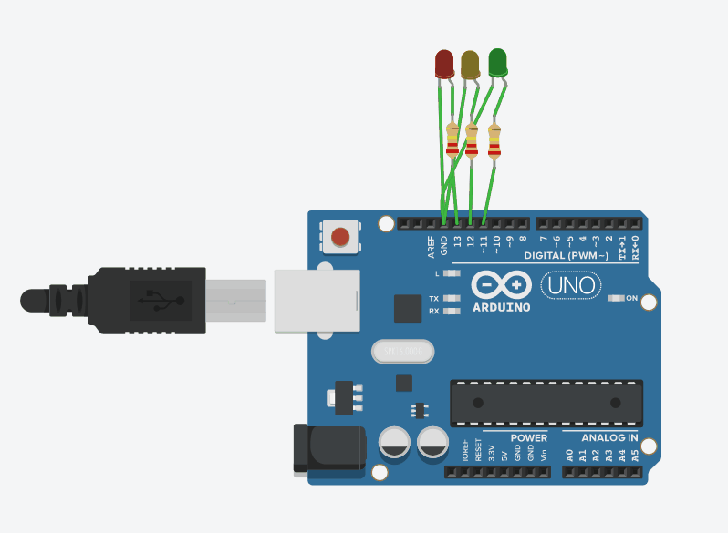
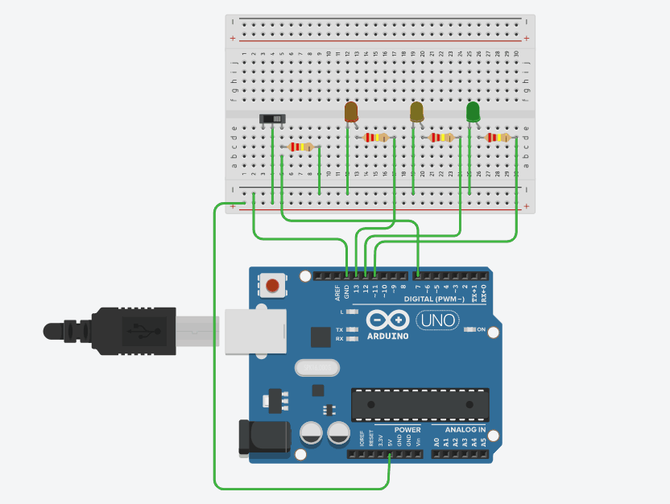
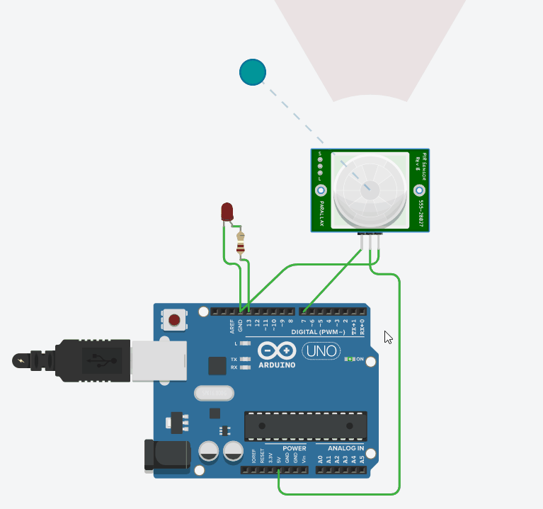

# Ejercicio 1 #

Implementar el programa de parpadeo de LED, ampliándolo para que encienda y apague alternativamente tres LEDs (uno rojo, otro amarillo y otro verde), conectados a las salidas digitales 11, 12 y 13 del Arduino, a un intervalo de 1.5 segundos.

```c
void setup()
{
  pinMode(13, OUTPUT);
}

void loop()
{
  digitalWrite(13, HIGH);
  delay(1500);
  digitalWrite(13, LOW);
  delay(1500);
  digitalWrite(12, HIGH);
  delay(1500); 
  digitalWrite(12, LOW);
  delay(1500); 
  digitalWrite(11, HIGH);
  delay(1500); 
  digitalWrite(11, LOW);
  delay(1500); 
}
```


# Ejercicio 2 #

Partir del programa de parpadeo de LEDs anterior y ampliarlo con las modificaciones necesarias para que se encienda el LED rojo solo cuando se pulse un interruptor conectado a la entrada digital 7, y en ese momento se apaguen los LEDs amarillo y verde.

```c
void setup()
{
  pinMode(13, OUTPUT);
  pinMode(12, OUTPUT);
  pinMode(11, OUTPUT);
  pinMode(7, INPUT);
}

void loop()
{
    if ((digitalRead(7) == true)) {
      digitalWrite(13, HIGH);
      digitalWrite(12, LOW);
      digitalWrite(11, LOW);

    } else if ((digitalRead(7) == false)) {
      digitalWrite(13, LOW);
      digitalWrite(12, HIGH);
      digitalWrite(11, HIGH);
    }
}
```


# Ejercicio opcional: detector de presencia #
Un led se encenderá cuando un sensor detecte una presencia. Para ello se hace uso de un sensor PIR. Conectamos el led al pin 13 y el sensor al pin 7.

```c
void setup()
{
  pinMode(13, OUTPUT);
  pinMode(7, INPUT);
}

void loop()
{
  if(digitalRead(7) == HIGH){
  	digitalWrite(13, HIGH);  
    delay(150);
    digitalWrite(13, LOW);
  }
}
```


