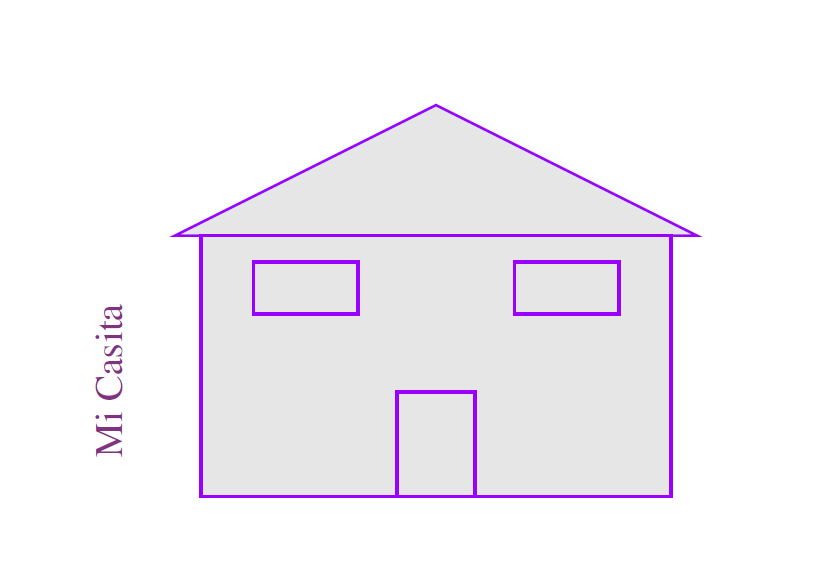
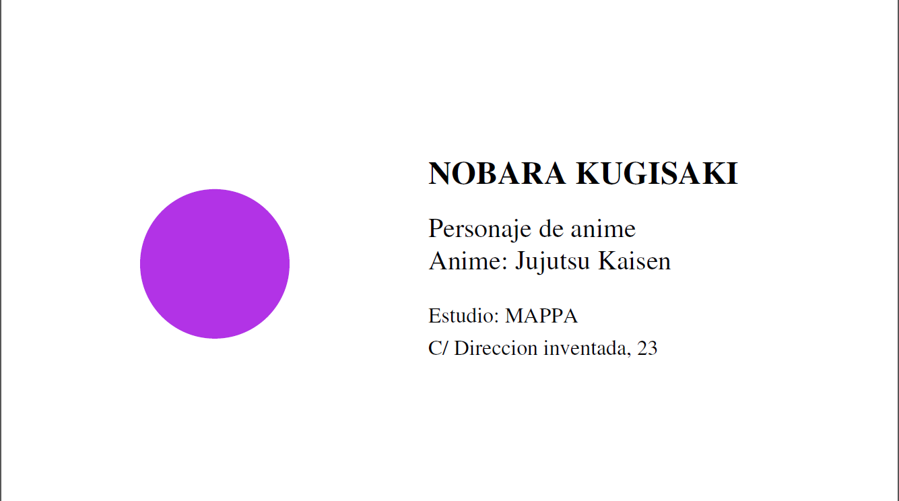

# Ejercicio 1 #

## Código ##

```ps
%!PS
%%Inicializamos el objeto

  %%Dibujamos el tejado

  newpath
	200 300 moveto
	300 350 lineto
	400 300 lineto
	closepath
  gsave

  %%Elegimos el color de relleno
  0.90 setgray
  fill
  grestore

  %%Elegimos el color para la linea
  0.6 0.0 1 setrgbcolor
  stroke

  %%%%%%%%%%%%%%%%%%%%%%%%%%%%%%%%%%%%%%%%%

  %%Dibujamos la casa
  newpath
	210 300 moveto
	390 300 lineto
	390 200 lineto
	210 200 lineto
	closepath
  gsave

  %%Elegimos el color de relleno
  0.90 setgray
  fill
  grestore

  %%Elegimos el color para la linea
  0.6 0.0 1 setrgbcolor
  stroke

  %%%%%%%%%%%%%%%%%%%%%%%%%%%%%%%%%%%%%%%%%

  %%Dibujamos la ventana izquierda
  newpath
	230 290 moveto
	270 290 lineto
	270 270 lineto
	230 270 lineto
	closepath
  gsave

  %%Elegimos el color de relleno
  0.90 setgray
  fill
  grestore

  %%Elegimos el color para la linea
  0.6 0.0 1 setrgbcolor
  stroke

  %%%%%%%%%%%%%%%%%%%%%%%%%%%%%%%%%%%%%%%%%

  %%Dibujamos la ventana derecha
  newpath
  330 290 moveto
  370 290 lineto
  370 270 lineto
  330 270 lineto
  closepath
  gsave

  %%Elegimos el color de relleno
  0.90 setgray
  fill
  grestore

  %%Elegimos el color para la linea
  0.6 0.0 1 setrgbcolor
  stroke

  %%%%%%%%%%%%%%%%%%%%%%%%%%%%%%%%%%%%%%%%%

  %%Dibujamos la puerta
  newpath
  285 240 moveto
  315 240 lineto
  315 200 lineto
  285 200 lineto
  closepath
  gsave

  %%Elegimos el color de relleno
  0.90 setgray
  fill
  grestore

  %%Elegimos el color para la linea
  0.6 0.0 1 setrgbcolor
  stroke

  %%%%%%%%%%%%%%%%%%%%%%%%%%%%%%%%%%%%%%%%%

  %%Escribimos el texto
  0.5 0.2 0.5 setrgbcolor
  /Times-Roman findfont
  15 scalefont
  setfont

  newpath
  180 215 moveto

  gsave
  90 rotate
  (Mi Casita) show
  grestore

showpage
```

## Resultado ##


# Ejercicio 2 #

## Código ##

```ps
%!PS

  %%Configuramos el tamaño de la tarjeta

  << /PageSize [840 600] >> setpagedevice

  %%Configuramos la letra
  /Times-Bold findfont
  30 scalefont
  setfont

  %%Escribimos el texto
  newpath
  400 400  moveto

  (NOBARA KUGISAKI) show

  %%Configuramos la letra (no queremos negrita)
  /Times-Roman findfont
  25 scalefont
  setfont

  %%Escribimos el texto
  newpath
  400 350  moveto
  (Personaje de anime) show
  400 320  moveto
  (Anime: Jujutsu Kaisen) show
  400 270  moveto

  /Times-Roman findfont
  20 scalefont
  setfont

  (Estudio: MAPPA) show
  400 240  moveto
  (C/ Direccion inventada, 23) show

  %%Dibujamos la circunferencia
  200 325 moveto
  % x y R angI angF
  200 325 70 0 360 arc
  0.7 0.2 0.9 setrgbcolor
  fill

  stroke

showpage
```

## Resultado ##

