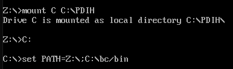
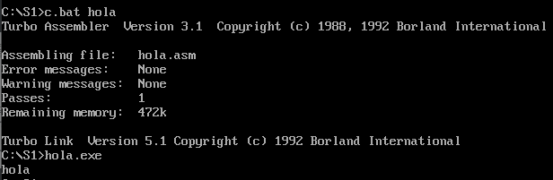
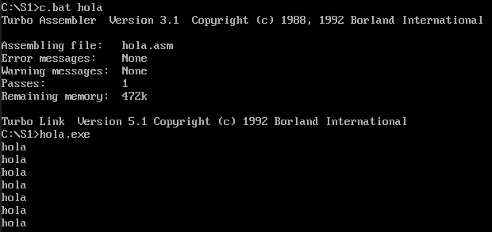

# SEMINARIO 1 #


## EJERCICIO 2 ##

**Configurar el inicio de DOSBox para que monte en la unidad C: el directorio donde se encuentra el entorno de programación Borland C (que incluye las herramientas para compilar no sólo lenguaje C, sino también ensamblador). Añadir a la variable “PATH” de inicio el directorio “bin” donde se encuentra el ejecutable BC.EXE.**

Añadimos las siguientes líneas al final del archivo conf de DOSBox:

```shell
mount C C:\PDIH
C:
set PATH=%PATH%;C:\bc/bin
```

Este código monta la unidad C, cambia el directorio actual a la unidad C (inicialmente se encuentra en el Z) y añade a la variable PATH el directorio "BIN".



## EJERCICIO 3 ##

**Crear el ejemplo “Hola mundo” en ensamblador, compilarlo y comprobar su funcionamiento. A continuación incluir un bucle para mostrar el mensaje 7 veces.**

Primero compilamos y comprobamos el funcionamiento de "Hola mundo".



Tras comprobar que funciona correctamente, incluimos el bucle.

```asm
bucle:
  mov dx,OFFSET msg
  mov ah,9
  int 21h
  inc cx
  cmp cx,7
  jne bucle
```

Si además queremos que al final de cada mensaje se incluya un "\n", cambiaremos el mensaje de la siguiente manera:

```asm
msg db 'hola', 10, '$'
```


