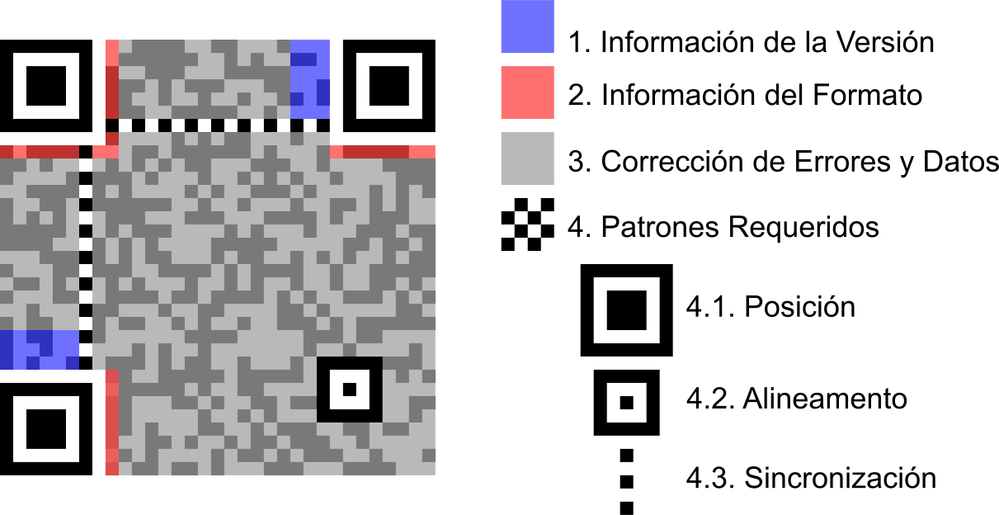

# Códigos QR #
## ¿Qué son? ##
Los códigos QR son códigos de barras bidimensionales en el que se pueden almacenar datos codificados. 

## ¿Cómo se estructuran? ##
La estructura de un código QR es una matriz bidimensional de dos colores contrastados (el más utilizado es blanco y negro) pero permiten cierto nivel de personalización. 
Existen varias versiones de versiones dependiendo de la cantidad de módulos que forman la matriz (a mayor cantidad de módulos, más información se puede almacenar).
La máxima capacidad de un código QR varía dependiendo del tipo de información que se almacene:

<ul>
<li>Numérico. 7089 caracteres</li>
<li>Alfanumérico. 4296 caracteres</li>
<li>Binario. 2953 bytes</li>
</ul>

Además cuentan con capacidad de corrección de errores cuya eficacia se divide en 4 niveles dependiendo de la cantidad de datos que se pueden recuperar:

<ul>
<li>Nivel L. Hasta el 7%</li>
<li>Nivel M (por defecto). Hasta el 15%</li>
<li>Nivel Q. Hasta el 25%</li>
<li>Nivel H. Hasta el 30%</li>
</ul>

Existe la versión código QR Micro en la que la simbología se ve reducida y puede representar hasta 35 dígitos o 21 caracteres alfanuméricos.

La estructura de la matriz se divide en: 

<ul>
<li>Patrón de posición. Es un patrón que ocupa 3 de las 4 esquinas para conocer la orientación exacta del código y la forma de interpretar la cadena de bits.</li>
<li>Formato de la informacion. URL, texto, Vcard...</li>
<li>Patrón de sincronización. Cadena de ceros y unos para poder seguir la alineación del patrón de posición.</li>
<li>Datos</li>
<li>Patrón de alineamiento. Identificador extra para conocer la orientación del QR</li>
<li>Versión</li>
</ul>

