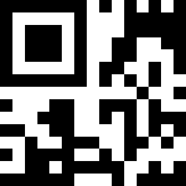

# Códigos QR #
## ¿Qué son? ##
Los códigos QR son códigos de barras bidimensionales en el que se pueden almacenar datos codificados. 

## ¿Cómo se estructuran? ##
La estructura de un código QR es una matriz bidimensional de dos colores contrastados (el más utilizado es blanco y negro) pero permiten cierto nivel de personalización. 
Existen varias versiones de versiones dependiendo de la cantidad de módulos que forman la matriz (a mayor cantidad de módulos, más información se puede almacenar).
La máxima capacidad de un código QR varía dependiendo del tipo de información que se almacene:

<ul>
<li>Numérico. 7089 caracteres</li>
<li>Alfanumérico. 4296 caracteres</li>
<li>Binario. 2953 bytes</li>
</ul>

Además cuentan con capacidad de corrección de errores cuya eficacia se divide en 4 niveles dependiendo de la cantidad de datos que se pueden recuperar:

<ul>
<li>Nivel L. Hasta el 7%</li>
<li>Nivel M (por defecto). Hasta el 15%</li>
<li>Nivel Q. Hasta el 25%</li>
<li>Nivel H. Hasta el 30%</li>
</ul>


Existe la versión código QR Micro en la que la simbología se ve reducida y puede representar hasta 35 dígitos o 21 caracteres alfanuméricos.

Código QR                                             |  Micro QR
:----------------------------------------------------:|:-----------------------------------------------------:
 |  

La estructura de la matriz se divide en: 

<ul>
<li>Patrón de posición. Es un patrón que ocupa 3 de las 4 esquinas para conocer la orientación exacta del código y la forma de interpretar la cadena de bits.</li>
<li>Formato de la informacion. URL, texto, Vcard...</li>
<li>Patrón de sincronización. Cadena de ceros y unos para poder seguir la alineación del patrón de posición.</li>
<li>Datos.</li>
<li>Patrón de alineamiento. Identificador extra para conocer la orientación del QR.</li>
<li>Versión.</li>
</ul>

<p align="center">
  
</p>


## Creación y lectura de códigos QR ##
Hay gran cantidad de bibliotecas para crear y leer códigos QR en python, pera esta demo usaremos qrcode y opencv. Primero instalamos las bibliotecas correspondientes:

```shell
pip3 install opencv-python qrcode numpy
```

### Generar un código QR ###
Primero vamos a usar únicamente la biblioteca qrcode:

```python
import qrcode

#datos a encriptar
datos = "https://www.google.es"

#Nombre del fichero (codigo qr)
archivo = "codigo.png"

#Generemos el codigo
imagen = qrcode.make(datos)

#Guardamos la imagen
imagen.save(archivo)
```

Generará una imagen con el nombre "codigo.png" que contiene el código QR con los datos deseados (una URL).

También podemos personalizar el código haciendo uso de qrcode.QRCode() de diversas maneras como especificar el tamaño, el color, control de errores... de la siguiente manera:

```python
import qrcode
import numpy as np

#datos a encriptar
datos = "https://www.google.es"

#Nombre del fichero (codigo qr)
archivo = "codigo.png"

#Instanciamos QRCode con la personalización que queramos
qr = qrcode.QRCode(version=2, box-size=15, border=5)
qr.add_data(datos)

#Compilamos los datos a un vector QR
qr.make()

#Convertimos el vector a una imagen
imagen = qr.make_image(fill_color="white", back_color="blue")

imagen.save(archivo)
```

Obtenemos la siguiente imagen como resultado:


### Escanear un código QR ###
Para escanear usaremos opencv. Para empezar leemos la imagen:

```python
import cv2
imagen = cv2.imread("qr.png")
```

Además opencv tiene un detector de códigos QR implementado que nos facilita la tarea:

```python
#Inicializamos el detector
detector = cv2.QRCodeDetector()

#Detectamos y decodificamos
datos, matriz, binario = detector.detectAndDecode(imagen)
```

*detectAndDecode()* decodifica la imagen y devuelve 3 valores: los datos decodificados, la matriz de vértices del código y el qr binarizado.

```python
#Si existe codigo QR
if matriz is not None:
  print("Datos: " + datos)
```

Por supuesto se puede escanear usando la webcam:

```python
import cv2

cap = cv2.VideoCapture(0)
imagen = cv2.imread("qr.png")

detector = cv2.QRCodeDetector()

while True:
    _, imagen = cap.read()

    datos, matriz, _ = detector.detectAndDecode(imagen)

    if matriz is not None:
        print("Datos: " + datos)

    if cv2.waitKey(0) == ord("q"):
        break
cap.release()

```
